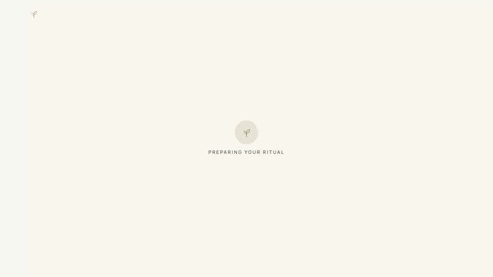
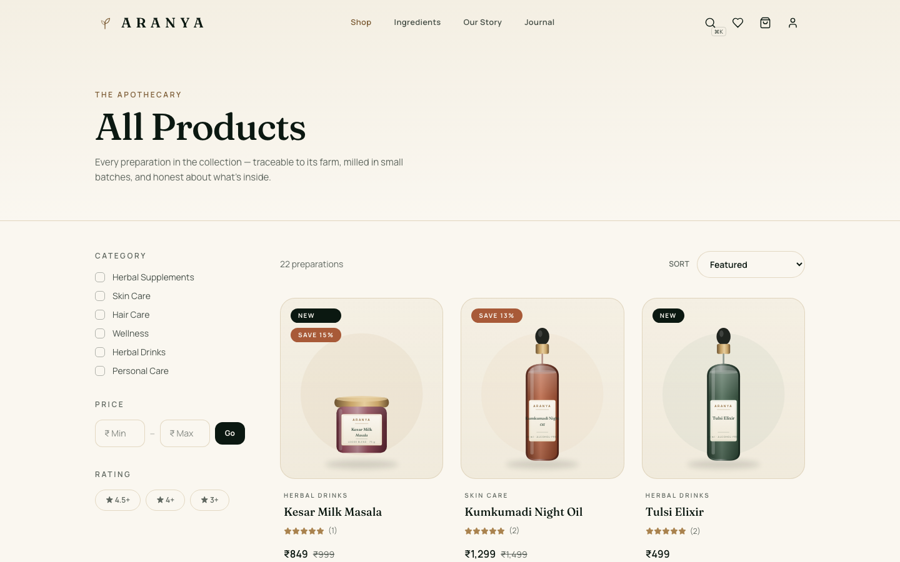
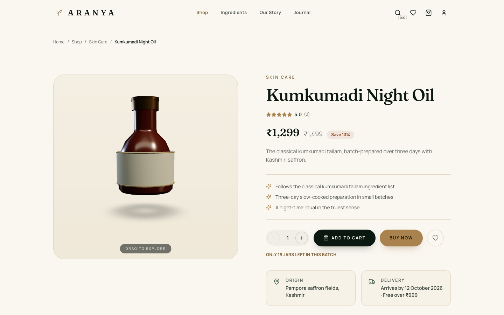
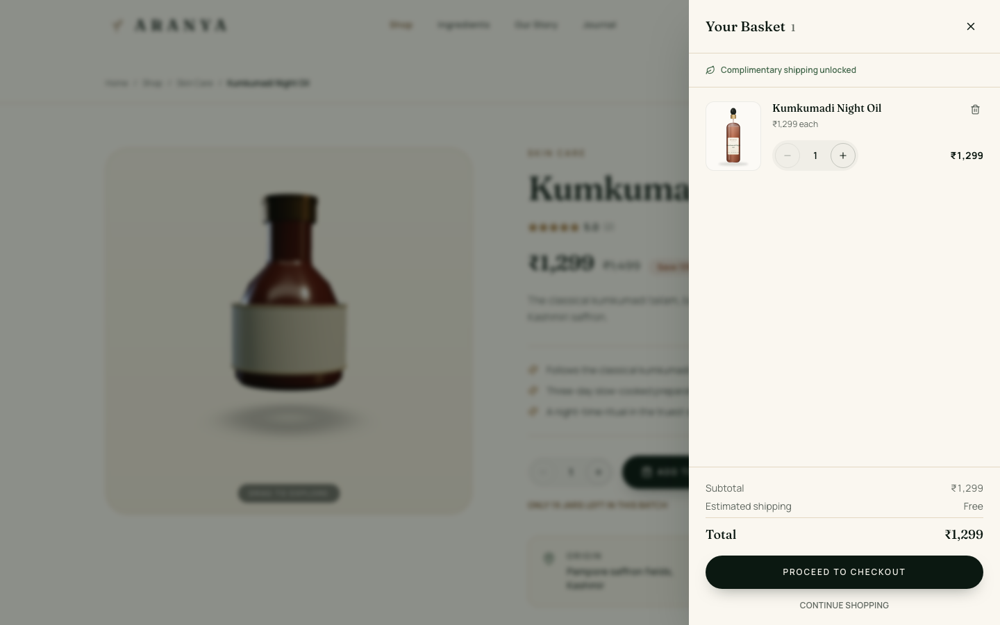
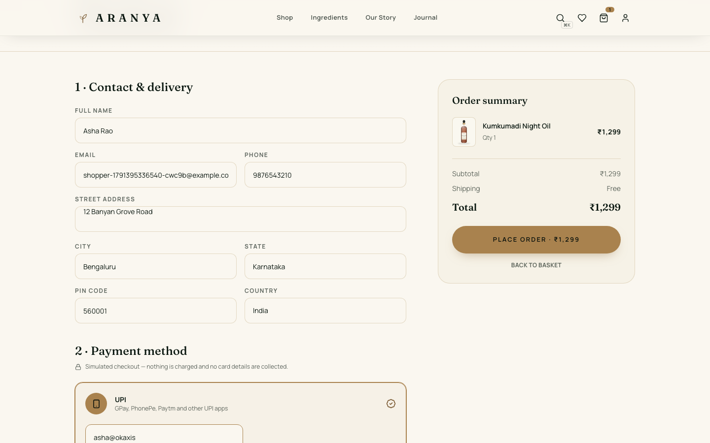
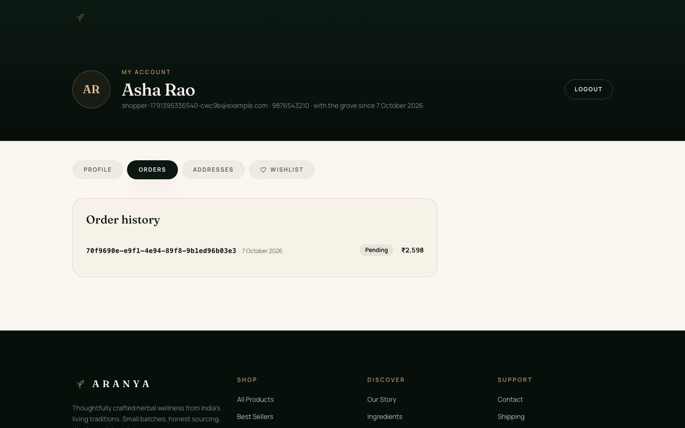
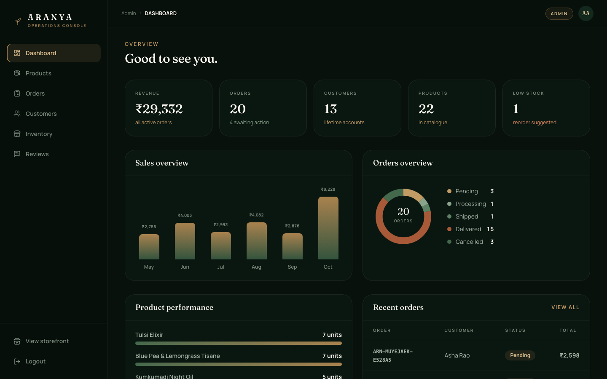
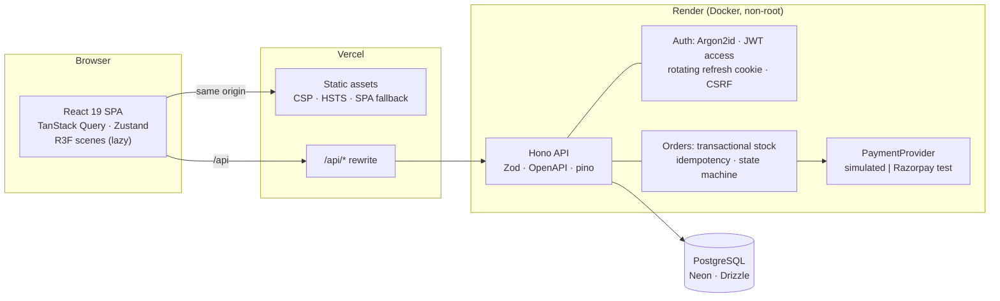

<div align="center">

# 🌿 ARANYA

**Ancient Wisdom. Naturally Reimagined.**

A full-stack, production-grade herbal-wellness store with cinematic 3D storytelling —
React 19 + Three.js on the front, a typed Hono + PostgreSQL API behind it.

[](https://github.com/pavan-dangeti/Aranya-Ecommerce/actions/workflows/ci.yml)
[](./LICENSE)


**[Live demo](https://aranya-ecommerce.vercel.app)** ·
**[Watch the demo](https://drive.google.com/drive/folders/1xwFmgx-OR8Zz4ChvHGvLr5EbTIM3jJYP?usp=drive_link)** ·
**[Deployment guide](./docs/DEPLOYMENT.md)** ·
**[Changelog](./CHANGELOG.md)**


</div>

---

## Walkthrough

<p align="center">
  
</p>

<p align="center"><a href="./docs/media/walkthrough.mp4">Full-quality MP4</a> · <a href="https://drive.google.com/drive/folders/1xwFmgx-OR8Zz4ChvHGvLr5EbTIM3jJYP?usp=drive_link">Original demo on Google Drive</a></p>

## Screenshots

|                                  Shop                                   |                                 Product with 3D viewer                                  |
| :---------------------------------------------------------------------: | :-------------------------------------------------------------------------------------: |
|              |  |
|                                **Cart**                                 |                                      **Checkout**                                       |
|                    |                              |
|                          **Account & orders**                           |                                    **Admin console**                                    |
|  |                     |

<p align="center">
  
  &nbsp;
  
</p>

## Features

**Storefront**

- Cinematic home: procedural 3D botanical hero, ingredient tilt cards, an interactive product vessel and a scroll-driven journey, with no model downloads.
- Shop with URL-synced category, price and rating filters, five sort modes and server pagination.
- ⌘K command palette with search-as-you-type against the live catalogue.
- Product pages with a drag-to-rotate 3D viewer, moderated reviews, related products and Product JSON-LD.
- Guest cart in local storage, merged into the server cart on sign-in; optimistic cart and wishlist updates.
- Checkout with server-computed totals and UPI, card or cash on delivery through a simulated gateway (Razorpay test mode behind env vars).
- Accounts: register, sign in with redirect-back, silent session restore, forgot and reset password, profile, addresses, order history.

**Operations console** (`/admin`, admin role enforced by the server)

- Dashboard with revenue, order mix, low stock and recent orders.
- Products, orders, customers, inventory and reviews with server-side pagination, filtering and sorting.
- Order status changes validated by a state machine; every admin write lands in an audit log.

**Platform**

- `GET /api/health` (liveness) and `/api/health/ready` (database), graceful shutdown, request ids in structured pino logs.
- One error envelope everywhere: `{ "error": { "code", "message", "requestId", "details?" } }`.
- OpenAPI 3.1 generated from the Zod schemas, browsable at `/docs`.
- Cold-start aware client: it warms the API on load and shows "Waking up the server…" while a sleeping free-tier host boots.

## Architecture



```
.
├── web/              React app (Vite, Tailwind 4, R3F, framer-motion)
├── server/           Hono API, Drizzle schema and migrations, seed, Vitest suites
├── packages/shared/  Zod schemas, API types and pricing rules used by both sides
├── packages/data/    Deterministic seed catalogue (products, articles, reviews…)
├── e2e/              Playwright journeys, accessibility and security checks
├── docs/             Deployment guide, release notes, screenshots
└── scripts/          Bundle-budget check used in CI
```

## Tech stack

| Layer     | Choice                                                                                        |
| --------- | --------------------------------------------------------------------------------------------- |
| Web       | React 19, TypeScript (strict), Vite 7, Tailwind CSS 4, React Router 7                         |
| 3D/motion | three.js, React Three Fiber, drei, framer-motion (`LazyMotion`)                               |
| Data      | TanStack Query 5 (caching, retries, optimistic updates), Zustand (UI state and guest cart)    |
| API       | Node 22, Hono, `@hono/zod-openapi`, Zod 4, pino                                               |
| Database  | PostgreSQL 16, Drizzle ORM and drizzle-kit migrations                                         |
| Auth      | Argon2id, short-lived JWT access tokens, rotating opaque refresh tokens in an httpOnly cookie |
| Quality   | Vitest, Playwright, axe-core, ESLint, Prettier, knip, Dependabot, GitHub Actions              |
| Hosting   | Vercel (web), Render Docker free plan (API), Neon (Postgres)                                  |

## Security model

- **No trust in the client.** Roles live only in the database and signed tokens, and every `/api/admin/*` route runs behind a server-side admin guard. A Playwright test writes `role: "admin"` into every browser store and proves it grants nothing (the API answers 403).
- **Sessions.** A 15-minute access token is held in memory. The refresh token is random, stored only as a hash, sent as an `httpOnly`, `Secure`, `SameSite=Lax` cookie scoped to `/api/auth`, and rotated on every use. Re-presenting a rotated token revokes the whole token family (reuse detection).
- **CSRF.** Cookie-authenticated mutations need a double-submit token plus an `Origin` allow-list check.
- **Abuse.** Rate limits on login, register and forgot-password, keyed on the address the trusted proxy saw (forwarding headers are never taken from the client). Failed sign-ins are throttled per email and client, with an account-wide ceiling for guesses spread across many IPs that an owner's signed, expiring device cookie bypasses (a password change revokes it), so nobody can lock another person out. Unknown emails behave exactly like known ones. Password-reset links never reach production logs.
- **Privacy.** Public reviews show "First L." from the account name, never anything derived from an email.
- **Orders.** Prices, shipping (free over ₹999, otherwise ₹79) and totals are recomputed on the server. Stock is decremented in a transaction with row locks taken in a stable order, an idempotency key makes a double-clicked checkout create one order, and customers can only read their own orders.
- **Payments.** Behind a `PaymentProvider` interface; card data never touches the server.
- **Headers.** Strict CSP (`connect-src 'self'`), HSTS, `X-Frame-Options: DENY`, `nosniff` and a strict referrer policy via `vercel.json`. The API adds its own security headers, a CORS allow-list and a body-size cap.
- **Supply chain.** `npm audit` reports 0 high or critical issues, and Dependabot keeps npm and Actions current. There are no secrets in the repo; `.env.example` holds placeholders only.

## Performance

3D never blocks first paint. Scenes are `lazy()` chunks that load only near the viewport once the main thread is idle (on touch devices, after the first interaction). They render at `dpr ≤ 1.5`, pause off-screen and in hidden tabs, and skip particles on low-end hardware or with `prefers-reduced-motion`. The shop and admin routes never load three.js, and CI fails if that changes or if any route's initial JS exceeds 250 KB gzip.

**JavaScript on first load (gzip)**

| Route       | v1 prototype (three + r3f preloaded) | v2     |
| ----------- | ------------------------------------ | ------ |
| `/`         | ≈ 442 KB                             | 149 KB |
| `/products` | ≈ 437 KB                             | 140 KB |
| `/admin`    | ≈ 440 KB                             | 137 KB |

**Lighthouse 12, mobile preset, median of three local runs**

| Page            | Performance | Accessibility | Best practices | SEO | LCP   | CLS   |
| --------------- | :---------: | :-----------: | :------------: | :-: | ----- | ----- |
| `/` v1          |     20      |      93       |      100       | 100 | 5.0 s | 0.40  |
| `/` v2          |     83      |      100      |      100       | 100 | 3.4 s | 0.001 |
| `/products` v1  |     58      |      94       |      100       | 100 | 4.2 s | 0.40  |
| `/products` v2  |     93      |      98       |      100       | 100 | 3.0 s | 0.000 |
| product page v1 |     66      |      85       |      100       | 100 | 4.3 s | 0.20  |
| product page v2 |     87      |      98       |      100       | 100 | 3.7 s | 0.000 |

The remaining gap to 90+ on the home and product pages is client-side rendering itself: nothing paints until the entry chunk runs. Prerendering is on the roadmap.

## Tests

| Suite                                  |  Count | What it covers                                                                                                                                                                                                                               |
| -------------------------------------- | -----: | -------------------------------------------------------------------------------------------------------------------------------------------------------------------------------------------------------------------------------------------- |
| Server integration (Vitest + Postgres) |    157 | Pricing and shipping, the last-unit stock race, idempotent checkout, login, refresh rotation, reuse detection, logout, role enforcement, rate limits, order ownership, the status state machine, Zod rejections                              |
| Web unit (Vitest)                      |     52 | API client error paths (401 refresh, 403, cold-start retries, empty messages), guest-cart store, form validators, server-error mapping                                                                                                       |
| End-to-end (Playwright)                | 22 × 2 | Browse, filter and search, ⌘K palette, quick view, cart, wishlist, register → checkout → order in profile → logout, admin edits, 403 on a forced `/admin`, axe-core with zero serious violations; on desktop Chromium and a Pixel 7 viewport |

Server tests run against a real PostgreSQL database, not mocks.

## Run it locally

Requires Node 22 (`.nvmrc`) and Docker.

```bash
cp .env.example .env          # placeholders; set SEED_ADMIN_* to your own values
docker compose up -d postgres # Postgres 16 on :55432, plus the test databases
npm ci
npm run db:setup              # build shared packages, migrate, seed the catalogue
npm run dev                   # web on :5173, API on :8787 (OpenAPI at :8787/docs)
```

Sign in as admin at `/login/admin` with the `SEED_ADMIN_EMAIL` and `SEED_ADMIN_PASSWORD` from your `.env`. Seeded demo customers use `SEED_DEMO_PASSWORD`. In development, password-reset emails are printed to the API console.

| Script               | Does                                                                     |
| -------------------- | ------------------------------------------------------------------------ |
| `npm run dev`        | API and web together with hot reload                                     |
| `npm test`           | Vitest: server (real Postgres) and web projects                          |
| `npm run test:e2e`   | Playwright on a fresh `aranya_e2e` database (API on :8788, web on :4173) |
| `npm run verify`     | lint → typecheck → knip → format check → tests → build → bundle budget   |
| `npm run db:migrate` | Apply Drizzle migrations                                                 |
| `npm run db:seed`    | Reload the deterministic catalogue (**truncates all tables**)            |
| `npm run media`      | Regenerate the screenshots and walkthrough in `docs/media`               |

## Configuration

Every variable is documented in [`.env.example`](./.env.example) and explained per host in [docs/DEPLOYMENT.md](./docs/DEPLOYMENT.md#environment-variables). These must be set in production:

| Variable              | Host   | Purpose                                                |
| --------------------- | ------ | ------------------------------------------------------ |
| `DATABASE_URL`        | Render | Neon pooled connection string                          |
| `JWT_SECRET`          | Render | Generated by the Render Blueprint                      |
| `CORS_ORIGINS`        | Render | The Vercel origin (also used by the CSRF origin check) |
| `PUBLIC_APP_URL`      | Render | Base URL for password-reset links                      |
| `SEED_ADMIN_EMAIL`    | Render | First admin, created only when none exists             |
| `SEED_ADMIN_PASSWORD` | Render | Its password (12+ characters)                          |

## Roadmap

- Prerender the storefront routes for sub-2.5 s LCP on slow mobile networks.
- Real transactional email (Resend or SES) behind the existing mail adapter.
- Razorpay live mode with webhook-driven order reconciliation.
- An image CDN for uploaded product photography.
- Search ranking with Postgres full-text and trigram indexes.

## License

[MIT](./LICENSE)
